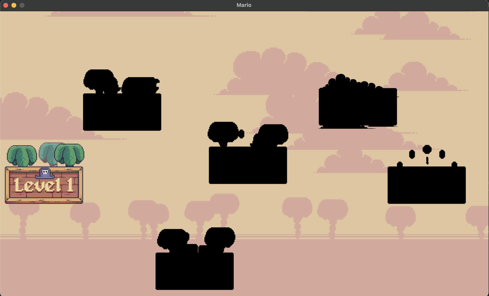
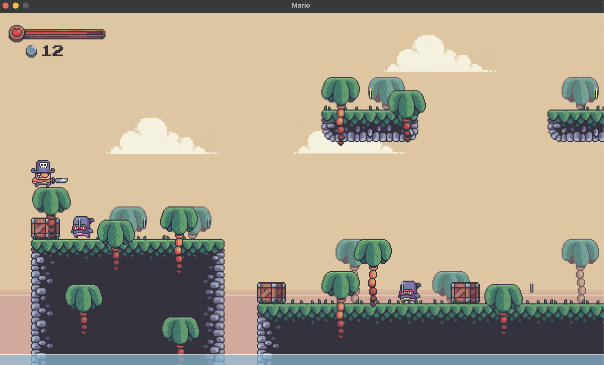

# How to play

The game starts in the overworld at level 1 <br/>
All other levels are locked until you clear the ones before <br/>
To start the game press spacebar <br/>
Controls are arrow keys (up, down, left and right) <br/>
Hitting an enemy headon will take away your health until you are on 0 health and have to start over <br/>
Hitting an enemy by jumping on them from the top will kill them <br/>
HINT: The coins add to your score with the golden ones adding double the amount as the silver ones. Gotta catch them all! <br/>
The goal is to reach the flag at the end of the level <br/>

To get it up and running, run

```
virtualenv .pyenv
source .pyenv/bin/activate
pip install requirements.txt
python main.py
```

# Screen grabs of the game

### Overworld



### Level



Happy gaming!
